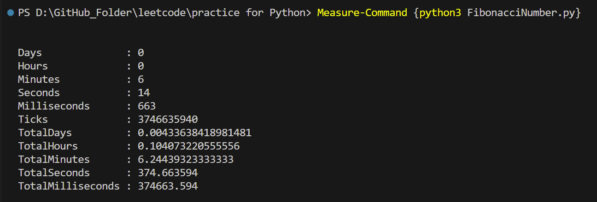
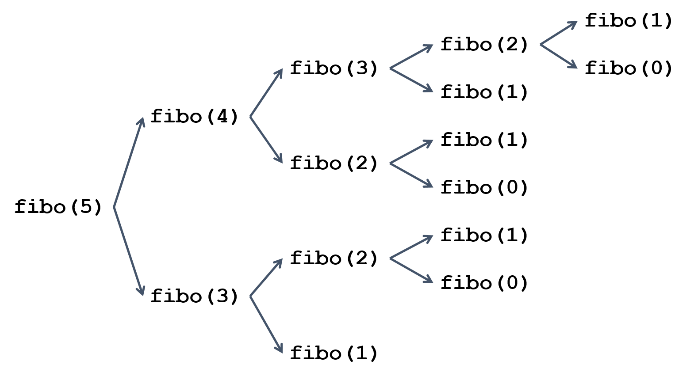
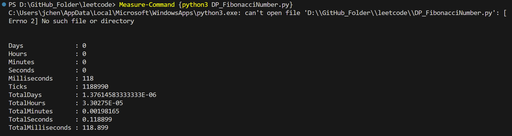

Reference：https://hackmd.io/@Gandolfreddy/fibo_DP_PY

# 直接執行 Fibonacci Number

```python
    f(n) = n,               if n <= 1
    f(n) = f(n-1)+f(n-2),   if n >  1
```

Measure-Command {python3 FibonacciNumber.py}
Fibanacci excute time


其中 Minutes、Seconds 與 Milliseconds 欄位可大略代表實際程式所花費時間（此部份會因電腦效能而有些許差異），欲找出費波納契數列的第 45 項，就花費了約 6 分鐘 14.663 秒的執行時間。


由於上述程式是以遞迴方式實作費波納契數列，所以在分析程式行為時，可開展出以下樹狀圖。




此時就很適合引入動態規劃的觀念，將原本重複呼叫的部分最佳化，其概念是儲存所有計算過的結果，如果又遇到相同的函式，可以省去重複計算。

以上圖來說 fibo(0)、fibi(1)、fibi(2)、fibi(3) 都被重複呼叫了好幾次



速度提升了好幾倍阿