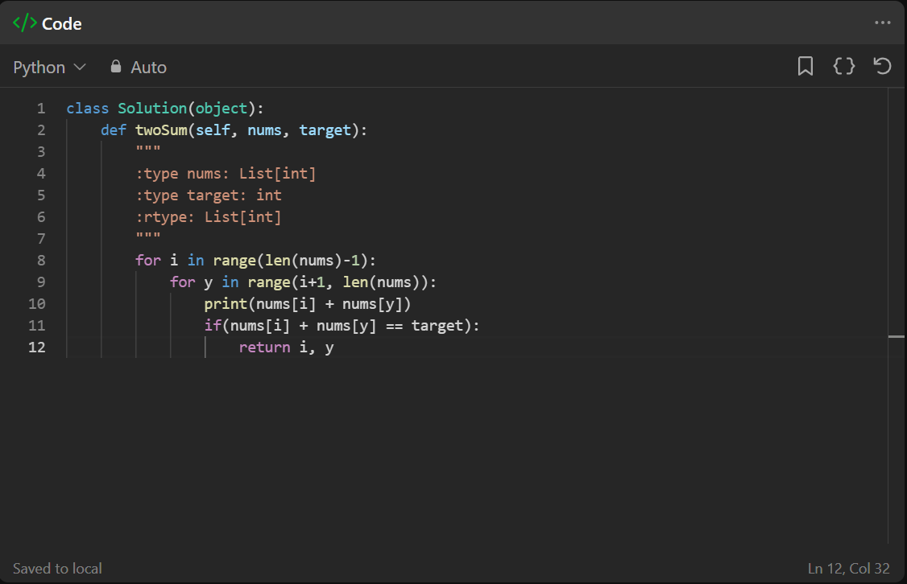

# 解題過程
一開始看到 leetcode 上面居然直接出現 class 真的是矇了

沒想到題目給的初始狀態也有可能不一樣

昨天的 class 中還有包含 -> 查了才知道原來是註解

    def twoSum(self, nums, target) -> (list, int):

像是這樣 -> 後面表示的是提示，註解返回值

參考資料：https://segmentfault.com/q/1010000009112777

# 資料夾檔案
在資料夾中的兩份檔案，一份是有 __init__，一份沒有
在 leetcode 底層運作的程式中，應該是沒有 __init__ 的



因為在 class 中若有包含 __init__ 函數，底下宣告的 def function 就可以不用額外使用 nums 和 target

以下為範例：
``` python
class Solution(object):
    def __init__(self, nums, target):
        """
        :type nums: List[int]
        :type target: int
        """
        self.nums = nums
        self.target = target

    def twoSum(self):
        """
        :rtype: List[int]
        """
        n = len(self.nums)
        for i in range(n - 1):
            for j in range(i + 1, n):
                if self.nums[i] + self.nums[j] == self.target:
                    return [i, j]
        return []  # No solution found

# 创建 Solution 类的实例并传递参数
nums = [2, 7, 11, 15]
target = 9
solution_instance = Solution(nums, target)

# 调用 twoSum 函数
result = solution_instance.twoSum()

# 输出结果
print("Indices of the two numbers:", result)
```

感謝 ChatGPT

最後令人高興的是我想的方法是標準答案，雖然也是最爛的暴力破解，看到還有人提供另外兩種解法