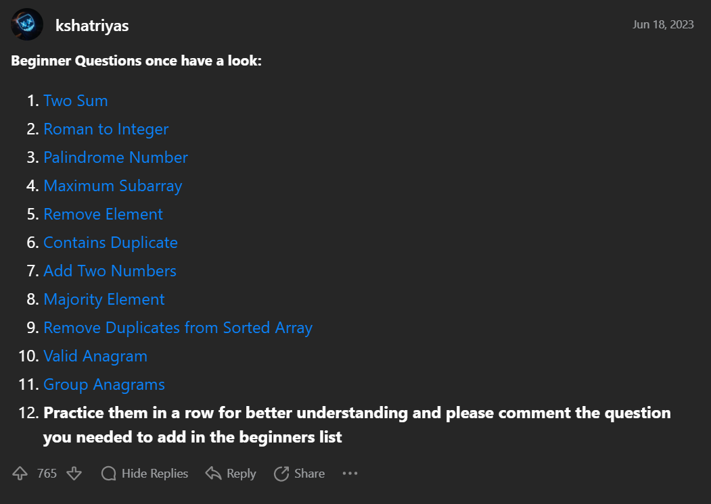

"# leetcode" 

Use python to complete leetcode or any topic you see

see it: https://leetcode.com/problems/two-sum/solutions/3619262/3-method-s-c-java-python-beginner-friendly/

先把這 11 題完成吧！

| Way1 | Way2 | Way3 | topic|
| :---:| :---: | :---: | :---: |
✔️|✔️|✔️| [Two Sum](https://leetcode.com/problems/two-sum/solutions/3619262/3-method-s-c-java-python-beginner-friendly/)
|✔️|✔️|✔️|[Roman to Integer](https://leetcode.com/problems/roman-to-integer/solutions/3651672/best-method-c-java-python-beginner-friendly/)
|✔️|✔️|✔️|[Palindrome Number](https://leetcode.com/problems/palindrome-number/solutions/3651712/2-method-s-c-java-python-beginner-friendly/)
|✔️|(DP)⚠️||[Maximum Subarray](https://leetcode.com/problems/maximum-subarray/solutions/3666304/beats-100-c-java-python-beginner-friendly/)
||||[Remove Element](https://leetcode.com/problems/remove-element/solutions/3670940/best-100-c-java-python-beginner-friendly/)
||||[Contains Duplicate](https://leetcode.com/problems/contains-duplicate/solutions/3672475/4-method-s-c-java-python-beginner-friendly/)
||||[Add Two Numbers](https://leetcode.com/problems/add-two-numbers/solutions/3675747/beats-100-c-java-python-beginner-friendly/)
||||[Majority Element](https://leetcode.com/problems/majority-element/solutions/3676530/3-methods-beats-100-c-java-python-beginner-friendly/)
||||[Remove Duplicates from Sorted Array](https://leetcode.com/problems/remove-duplicates-from-sorted-array/solutions/3676877/best-method-100-c-java-python-beginner-friendly/)
||||[Valid Anagram](https://leetcode.com/problems/valid-anagram/solutions/3687854/3-methods-c-java-python-beginner-friendly/)
||||[Group Anagrams](https://leetcode.com/problems/group-anagrams/solutions/3687735/beats-100-c-java-python-beginner-friendly/)