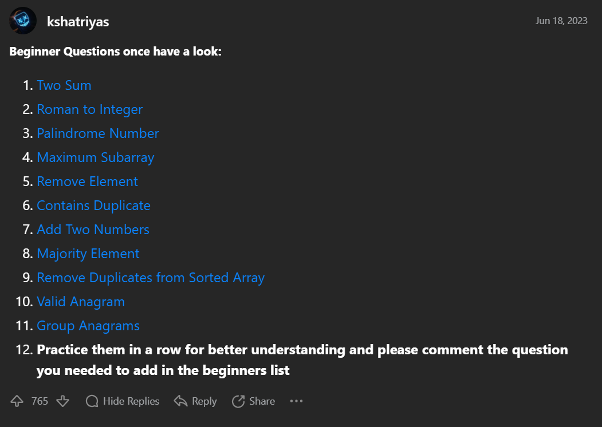

# 🚀 LeetCode Practice

Use Python to complete LeetCode and strengthen problem-solving skills.

---

## 🔗 Reference
- [Two Sum Solutions (3 Methods)](https://leetcode.com/problems/two-sum/solutions/3619262/3-method-s-c-java-python-beginner-friendly/)

---

## 🧩 Current Progress (Starter 11)

| Way1 | Way2 | Way3 | Topic |
| :--: | :--: | :--: | :-- |
| ✔️ | ✔️ | ✔️ | [1. Two Sum](https://leetcode.com/problems/two-sum/) |
| ✔️ | ✔️ | ✔️ | [12. Roman to Integer](https://leetcode.com/problems/roman-to-integer/) |
| ✔️ | ✔️ | ✔️ | [9. Palindrome Number](https://leetcode.com/problems/palindrome-number/) |
| ✔️ | (DP)⚠️ |  | [53. Maximum Subarray](https://leetcode.com/problems/maximum-subarray/) |
| ✔️ |  |  | [27. Remove Element](https://leetcode.com/problems/remove-element/) |
| ✔️ |  |  | [217. Contains Duplicate](https://leetcode.com/problems/contains-duplicate/) |
| ✔️ |  |  | [2. Add Two Numbers](https://leetcode.com/problems/add-two-numbers/) |
| ✔️ |  |  | [169. Majority Element](https://leetcode.com/problems/majority-element/) |
| ✔️ |  |  | [26. Remove Duplicates from Sorted Array](https://leetcode.com/problems/remove-duplicates-from-sorted-array/) |
| ✔️ |  |  | [242. Valid Anagram](https://leetcode.com/problems/valid-anagram/) |
| ✔️ |  |  | [49. Group Anagrams](https://leetcode.com/problems/group-anagrams/) |

---

## 🎯 Top 50 Must-Know Questions (By Category)

### 🟢 Array / Hash (🔥 Most Important)
- Two Sum  
- Contains Duplicate  
- Valid Anagram  
- Group Anagrams  
- Top K Frequent Elements  
- Product of Array Except Self  
- Longest Consecutive Sequence  

👉 Learn:
- HashMap mindset  
- Space vs Time tradeoff  
- Frequency counting  

---

### 🟡 Two Pointers
- Valid Palindrome  
- Two Sum II  
- 3Sum  
- Container With Most Water  

👉 Core: Left & Right pointers  

---

### 🔵 Sliding Window
- Longest Substring Without Repeating Characters  
- Longest Repeating Character Replacement  
- Minimum Window Substring  

👉 Core: Dynamic window  

---

### 🟣 Stack
- Valid Parentheses  
- Min Stack  
- Daily Temperatures  
- Largest Rectangle in Histogram  

👉 Core: Monotonic stack  

---

### 🟠 Binary Search
- Binary Search  
- Search in Rotated Sorted Array  
- Find Minimum in Rotated Sorted Array  
- Search a 2D Matrix  

👉 Core: Condition shrinking  

---

### 🔴 Linked List
- Reverse Linked List  
- Merge Two Sorted Lists  
- Linked List Cycle  
- Remove Nth Node From End  
- Copy List with Random Pointer  

👉 Core:
- Pointer manipulation  
- Dummy node  

---

### 🌲 Tree (🔥🔥 Super Important)
- Maximum Depth of Binary Tree  
- Same Tree  
- Invert Binary Tree  
- Level Order Traversal  
- Validate BST  
- Lowest Common Ancestor  

👉 Core:
- DFS / BFS  
- Recursion  

---

### 🌐 Graph
- Number of Islands  
- Clone Graph  
- Course Schedule  
- Word Ladder  

👉 Core:
- Traversal  
- Topological sort  

---

### 🧠 Backtracking
- Subsets  
- Permutations  
- Combination Sum  

👉 Core: Decision tree  

---

### 💰 Heap / Priority Queue
- Kth Largest Element  
- Top K Frequent Elements  
- Find Median from Data Stream  

👉 Core: Top K problems  

---

### ⚡ Dynamic Programming (🔥 Critical)
- Climbing Stairs  
- House Robber  
- Coin Change  
- Longest Increasing Subsequence  
- Word Break  

👉 Core:
- State definition  
- Transition formula  

---

### 📐 Greedy / Interval
- Jump Game  
- Merge Intervals  

👉 Core: Local optimal → Global optimal  

---

## 📚 Extra Practice
- [30 Days of JavaScript](https://leetcode.com/studyplan/30-days-of-javascript/)

---

## 📝 Notes

### Python Functions (From NeetCode)
- [Quizlet Flashcards](https://quizlet.com/tw/938125480/python-%E5%87%BD%E6%95%B8-flash-cards)

---

## 🎯 Goal
- Finish Top 50
- Build strong intuition for patterns
- Improve coding interview performance

# 🧠 LeetCode 50 Roadmap (14 Days Plan)

Goal:
- Build problem-solving intuition
- Master core patterns
- Prepare for interviews

---

## ✅ Day 1 — Array / Hash (基礎)
- [✔️］Two Sum  
- [✔️］Contains Duplicate  
- [ ] Valid Anagram  

---

## ✅ Day 2 — Array / Hash (進階)
- [ ] Group Anagrams  
- [ ] Top K Frequent Elements  

---

## ✅ Day 3 — Array / Hash（高頻技巧）
- [ ] Product of Array Except Self  
- [ ] Longest Consecutive Sequence  

🔁 Review: Two Sum

---

## ✅ Day 4 — Two Pointers
- [ ] Valid Palindrome  
- [ ] Two Sum II  
- [ ] Container With Most Water  

---

## ✅ Day 5 — Two Pointers（Hard 思維）
- [ ] 3Sum  

🔁 Review: Valid Palindrome

---

## ✅ Day 6 — Sliding Window
- [ ] Longest Substring Without Repeating Characters  
- [ ] Longest Repeating Character Replacement  

---

## ✅ Day 7 — Sliding Window（經典）
- [ ] Minimum Window Substring  

🔁 Review: Sliding Window 觀念整理

---

## ✅ Day 8 — Stack
- [ ] Valid Parentheses  
- [ ] Min Stack  

---

## ✅ Day 9 — Stack（單調棧🔥）
- [ ] Daily Temperatures  
- [ ] Largest Rectangle in Histogram  

---

## ✅ Day 10 — Binary Search
- [ ] Binary Search  
- [ ] Search in Rotated Sorted Array  

---

## ✅ Day 11 — Binary Search（變形）
- [ ] Find Minimum in Rotated Sorted Array  
- [ ] Search a 2D Matrix  

---

## ✅ Day 12 — Linked List
- [ ] Reverse Linked List  
- [ ] Merge Two Sorted Lists  
- [ ] Linked List Cycle  

---

## ✅ Day 13 — Linked List（經典）
- [ ] Remove Nth Node From End  
- [ ] Copy List with Random Pointer  

---

## ✅ Day 14 — Tree（🔥超重點）
- [ ] Maximum Depth of Binary Tree  
- [ ] Same Tree  
- [ ] Invert Binary Tree  
- [ ] Level Order Traversal  
- [ ] Validate BST  
- [ ] Lowest Common Ancestor  

---

# 🚀 延伸（第二階段）

## Graph
- [ ] Number of Islands  
- [ ] Clone Graph  
- [ ] Course Schedule  
- [ ] Word Ladder  

## Backtracking
- [ ] Subsets  
- [ ] Permutations  
- [ ] Combination Sum  

## Heap
- [ ] Kth Largest Element  
- [ ] Find Median from Data Stream  

## Dynamic Programming（🔥關鍵）
- [ ] Climbing Stairs  
- [ ] House Robber  
- [ ] Coin Change  
- [ ] Longest Increasing Subsequence  
- [ ] Word Break  

## Greedy
- [ ] Jump Game  
- [ ] Merge Intervals  

---

# 🧩 Daily Strategy

Every day:
1. Solve problems (30 min)
2. Review 1 old problem
3. Write notes:

- 🧠 Idea
- ⏱ Complexity
- 🔁 Pattern

---

# 🏁 Goal

- Finish 50 questions
- Recognize patterns instantly
- Pass coding interviews